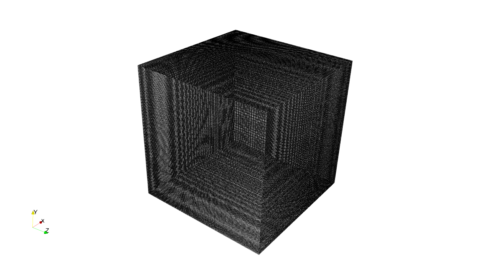
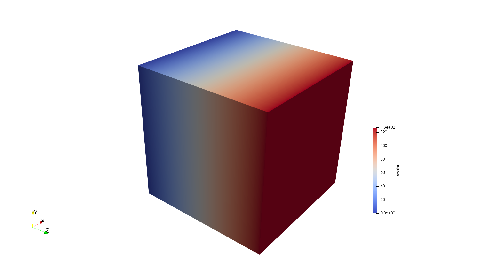

# VTKBinaryWriter
This repository contains routines to write vtk binary files for structured meshes

## Clone the git repository
```
git clone https://github.com/nataraj2/VTKBinaryWriter.git
cd VTKBinaryWriter
```
## Compilation and running
Serial writer in Fortran90  
```
cd serial_writer
gfortran -fconvert=big-endian -o out writevtk_serial.f90
./out
```
Parallel writer in f90-c++ 
```
cd parallel_writer/f90_and_cpp
make -j4
mpirun -np <nprocs> vtk_driver
```
This writes a binary vtk file - `grid.vtk` with the mesh and one scalar field. 
An example with `mpirun -np 128 vtk_driver` for `128x128x128` is shown in the image 
below.

## Notes
1. To demonstrate the parallelization, the domain is decomposed only in the z-direction.  
Make sure the `nz` is divisible by the number of processors used to run. But the parallel 
writer is generic and does not assume anything about the domain decomposition.  

2. The mesh is trivial and is directly coded in the c++ code. The scalar data is 
initialized in the fortran code and is passed into the c++ code. The same can be 
done with the mesh as well.

## Results
The images show the mesh and the scalar field in VisIt and ParaView

20x20x20 mesh and scalar field  
 


128x128x128 mesh and scalar field with f90-cpp  
 
